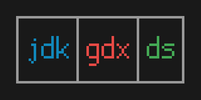

# jdkgdxds



Taking libGDX's data structures and implementing JDK interfaces.

Primitive-backed? Insertion-ordered? Value-sortable? Double-ended? Case-insensitive? **WE HAVE IT ALL!**
Lists, Bags, Deques, Sets, Maps! This library supplies most of the common varieties of data structures, and tries to
reduce how much memory it allocates all over. It works on all common and not-so-common platforms, including HotSpot
JDKs, Graal Native Image, Android, iOS via RoboVM or Multi-OS Engine, browsers via Google Web Toolkit or TeaVM, etc.
Reflection is entirely avoided. Variants on maps and sets are available to treat keys as case-insensitive, ignore/edit
certain characters in String keys while hashing/comparing, or use Enum keys efficiently and without breaking normal
serialization rules. We have an EnumMap and EnumSet that actually have zero-argument constructors! We have an all-around
improvement to `java.util.ArrayDeque` that implements both Deque and List, allows `O(1)` lookup at any index, and didn't
forget to implement `equals()` and `hashCode()`: `ObjectDeque` ! For every unordered map or set, an insertion-ordered
variant is provided. These ordered variants can also be sorted offline, including by key or by value for maps. We have a
`CharList` that can fill in for a `StringBuilder` in some ways while still being used as a collection.

The library and [all](https://github.com/tommyettinger/funderby) its
[dependencies](https://github.com/tommyettinger/digital) should be under 2MB in size, and can be easily reduced in size
further by tools like R8 or ProGuard that perform dead code elimination.
[Compare that](https://central.sonatype.com/artifact/it.unimi.dsi/fastutil-core) with
[FastUtil Core](https://github.com/vigna/fastutil/), if you want! This library uses some code from FastUtil for sorting,
and both projects are Apache-licensed. Note that FastUtil won't work on all platforms jdkgdxds targets, such as RoboVM.

[JavaDocs are here.](https://tommyettinger.github.io/jdkgdxds/apidocs/)

# tl;dr Instructions

Gradle dependency (for all platforms except GWT):
```
api "com.github.tommyettinger:jdkgdxds:1.13.1"
```

For GWT, see "How do I get it?" below, or use TeaVM instead.

If you use libGDX, you can let gdx-liftoff set up the dependency by checking the `jdkgdxds` checkbox under third-party
extensions. This also can optionally allow you to depend on `jdkgdxds-interop` for JSON saving/loading, `kryo-jdkgdxds`
for Kryo saving/loading, or `tantrum-jdkgdxds` for Apache Fory saving/loading.

## What is this?

Some background, first... libGDX has its own data structures, and they're mostly nice to work with. They have fast iteration by
reusing iterators, they are designed to use low memory (both in the way the hashed maps and sets are designed and by allowing
primitive data types for many data structures), and they have some nice features that aren't present in all standard libraries,
like optional insertion-ordering. The problem with libGDX's data structures is that they are extremely limited in what interfaces
they implement, typically implementing no more than `java.io.Serializable` and `java.lang.Iterable`. They also are limited to Java
6 or 7 features, despite Java 8 features being available on Android and GWT for some time now, and even reaching iOS soon, if not
already. So what is this? It is a redo of libGDX's data structures so that they implement common JDK interfaces like
`java.util.Map`, `java.util.List`, and `java.util.Set`, plus their parts that can't implement generic interfaces use interfaces
defined here, such as `PrimitiveCollection`, `Ordered`, `FloatIterator`, `LongComparator`, and so on. It also sharply increases
the number of primitive-backed maps; they don't implement `java.util.Map`, but often implement other interfaces here. As an
example, `com.github.tommyettinger.ds.IntLongOrderedMap` implements `com.github.tommyettinger.ds.Ordered.OfInt`, which specifies
that the order of items (keys here) is represented by a `com.github.tommyettinger.ds.IntList` containing those keys.

## OK, how do I use it?

You use jdkgdxds much like the standard JDK collections, just extended for primitive types. The types of data structure offered
here are lists (array-backed, like `ArrayList`), deques (double-ended queues, like `ArrayDeque` but also allowing access inside
the deque), sets (allowing only unique items, and coming in unordered and insertion-ordered varieties), maps (allowing unique keys
associated with values, and also coming in unordered and insertion-ordered varieties), bags (unordered lists, with fast removal
but unpredictable iteration order) and some extra types. The Object-based classes are generic, centered around
`com.github.tommyettinger.ds.ObjectList`, `com.github.tommyettinger.ds.ObjectDeque`,`com.github.tommyettinger.ds.ObjectSet`, and
`com.github.tommyettinger.ds.ObjectObjectMap`; `ObjectOrderedSet` and `ObjectObjectOrderedMap` are also here and extend the other
Set and Map. These are effectively replacements for `com.badlogic.gdx.utils.Array`, `com.badlogic.gdx.utils.Queue`,
`com.badlogic.gdx.utils.ObjectSet`, `com.badlogic.gdx.utils.ObjectMap`, `com.badlogic.gdx.utils.OrderedSet`, and
`com.badlogic.gdx.utils.OrderedMap`. As nice as it would be to just call these by the same names (except Array and Queue, those
are just confusing), we have other kinds of Object-keyed Maps, and other kinds of insertion-ordered Maps, so `ObjectMap` is now
`ObjectObjectMap` because it has Object keys and Object values, while `OrderedMap` is now `ObjectObjectOrderedMap`, because of the
same reason.

Primitive-backed collections support `int` and `long` keys, and `int`, `long`, or `float` values; all primitive types are
available for lists, deques, and bags. So, there's `IntSet` and `LongSet`, with ordered variants `IntOrderedSet` and
`LongOrderedSet`, while their map counterparts are more numerous. Most of the primitive lists are very similar, only changing the
numeric type, but there are some small changes for `CharList` (which doesn't define math operations on its items) and
`BooleanList` (which defines logical operations but not math ones). The deques don't currently implement math operations on their
items. Each of the bag classes extends a list class, and  changes its behavior on certain operations (like `remove()`, which takes
`O(1)` time instead of `O(n)`, but rearranges the items), while keeping the other operations mostly the same. A minor point to
note is that libGDX also supplies primitive arrays for all types, *except* that it doesn't have `DoubleArray`, where this library
does provide `DoubleList` (as well as `DoubleBag` and `DoubleQueue`). As for the maps...

There's `IntFloatMap`, `IntFloatOrderedMap`, `IntIntMap`, `IntIntOrderedMap`, `IntLongMap`, `IntLongOrderedMap`,
`IntObjectMap`, `IntObjectOrderedMap`, `LongFloatMap`, `LongFloatOrderedMap`, `LongIntMap`, `LongIntOrderedMap`,
`LongLongMap`, `LongLongOrderedMap`, `LongObjectMap`, and `LongObjectOrderedMap`, so I hope that's enough. Then again, there's
still `ObjectFloatMap`, `ObjectFloatOrderedMap`, `ObjectIntMap`, `ObjectIntOrderedMap`, `ObjectLongMap`, and
`ObjectLongOrderedMap` for the primitive-valued maps with Object keys. There's `IdentityObjectMap` and `IdentityObjectOrderedMap`,
which compare keys by reference identity (not by `equals()`) and hash their keys using their identity hash code. There's the
unusual `HolderSet` and `HolderOrderedSet`, which take an "extractor" function when constructed and use it to hash items by an
extracted value; this lets you, for example, make a HolderSet of "Employee" objects and look up a full Employee given only their
UUID. In that case, an Employee's value could change, and the result of hashCode() on an Employee would change, but as long as the
UUID of the Employee stays the same, the same Employee will be found by methods like `get()` and `contains()`. `NumberedSet` wraps
an `ObjectIntOrderedMap` and makes it so that Object keys can be looked up by index (using the standard ordered set methods like
`getAt()`), but also so that their `indexOf()` method runs in constant time instead of linear time. This is at the expense of
slower removal from the middle of the NumberedSet; that class doesn't implement insertion in the middle of the NumberedSet either.
There's also a close relative of libGDX's `BinaryHeap` class, but the one here implements the JDK's `Queue`.

There are some useful varieties of Map and Set here that don't show up very often in libraries. There's a `CaseInsensitiveMap`
and a `CaseInsensitiveOrderedMap` that require `CharSequence` keys (such as String or StringBuilder), but treat them as
case-insensitive, and allows a generic Object type for its values. A more generic solution to the same sort of problem lies in
`FilteredStringSet`, `FilteredStringOrderedSet`, `FilteredStringMap`, and `FilteredStringOrderedMap`. These filtered-String data
structures contain a filter (a predicate that determines if a char in a String should be read or skipped for hashing and equality
comparison purposes) and an editor (a function that can change what char is actually used in a hash or equality comparison). These
data structures can be used to implement the CaseInsensitive maps and sets (except one needs a key to be a String and where the
other uses a CharSequence) if the editor is `Character::toUpperCase`. In addition, they can do something like filter the Strings
so only the letter characters are considered (whitespace, punctuation, and numbers could all be skipped) using
`Character::isLetter` as the filter (or RegExodus' `Category.L::contains` for GWT compatibility). This goes on, to even more
filtered data structures: `FilteredIterableSet`, `FilteredIterableOrderedSet`, `FilteredIterableMap`, and
`FilteredIterableOrderedMap`, which act like the filtered-String data structures but work on keys or items that are each an
Iterable (type `I`) of sub-items/sub-keys (type `T` or `K`). The Iterable must not be modified while it is a key, or at least not
modified in a way that changes what is considered by the filter and editor.

New in version 1.5.2 are nearly-drop-in replacements for `java.util.EnumSet` and `java.util.EnumMap`, named, ah, `EnumSet` and
`EnumMap`. The main difference with these versions is that they can be constructed with a zero-argument constructor (and that is
vital for serialization done without using `java.io.Serializable`). Other than that, they are very similar to the `java.util`
classes, except that where the `java.util` types need a `Class` of an enum type when they are constructed, the types here can
take the result of calling `values()` on an enum type when constructed, or can figure out those values when an enum constant is
added to the Set or Map. Both the `EnumSet` here and in the standard library are very memory-efficient; the one here uses a bitset
made from a simple `int[]` (for better GWT performance). `EnumMap` is also rather efficient; the one here only needs to store the
key universe (another name for the result of `values()` mentioned above) and exactly as many value slots as there are items in the
key universe. `EnumMap` does also store a default value, which is usually `null`, and some other data.

The library includes expanded interfaces for these to implement, like the aforementioned `Ordered` interface,
`PrimitiveCollection` is akin to Java 8's `PrimitiveIterator`, some `float`-based versions of primitive specializations where
the JDK only offers `int`, `long`, and `double`, and primitive `Comparator`s (which are usable as Java 8
`FunctionalInterface`s, but don't implement that type for RoboVM compatibility). There is also `EnhancedCollection`,
which is used to add default methods to various classes here.

You can extend essentially all classes in jdkgdxds, and it's meant to be friendlier to inherit from than the libGDX collections.
The Object-keyed maps and sets have protected `place()` and `equate()` methods to allow changing the behavior of hashing (with
`place()`) and equality (with `equate()`). If you, for instance, wanted to use `char[]` as a key type in a map, the normal
behavior of an array in a hashed collection like a map or set is basically unusable. Arrays are compared by reference rather than
by value, so you would need the exact `char[]` you had put in to get a value out. They're also hashed by identity, which means
more than just the equality comparison needs to change. Thankfully, in jdkgdxds you can override `place()` to
`return Arrays.hashCode((char[])item) & mask;` and `equate()` to `return Objects.deepEquals(left, right);`; this uses standard JDK
methods to hash and compare arrays, and will work as long as you don't edit any array keys while they are in the map. There are
other potential uses for this extensibility, like the case-insensitive CharSequence comparison that `CaseInsensitiveMap` and
related classes use, or some form of fuzzy equality for float or double keys.

Most of the ordered data structures now allow `addAll()` or `putAll()` to specify a range with a starting index and count of how
many items to copy from the data structure passed as a parameter (often some kind of `Ordered`). This also optionally takes a
starting index to add the range at in the order. When constructing one of these ordered data structures with a copy constructor,
you usually have the option to copy only a range of the data structure you are copying. Similarly, there's often a `removeRange()`
method, also present on all ordered types except deques (and it takes a start and end index, rather than a start index and count,
which imitates the method by that name in the JDK, not the similar one in libGDX's Array class). All of these are intended to be
useful for imitating disjoint sets, and other ways of isolating part of a data structure. You might shuffle an `ObjectList`, then
make two more distinct `ObjectList`s by copying different ranges from the shuffled "deck," for example.

An oddity in libGDX's Array classes (such as IntArray, FloatArray, and of course Array) is that their removeAll() method doesn't
act like removeAll() in the JDK List interface. In `List.removeAll(Collection)`, when the Collection `c` contains an item even
once, every occurrence of that item is removed from the `List`. In libGDX, if an item appears once in the parameter, it is removed
once from the Array; similarly, if it appears twice, it is removed twice. Here, we have the List behavior for removeAll(), but
also keep the Array behavior in the newly-added `removeEach()`.

Here, we rely on some shared common functionality in two other libraries (by the same author).
[Digital](https://github.com/tommyettinger/digital) has core math code, including the BitConversion and Base classes that were
here earlier. [Funderby](https://github.com/tommyettinger/funderby) provides functional interfaces for primitive types, with a
rather large amount of total combinations. [Juniper](https://github.com/tommyettinger/juniper) has the random number generators
that also used to be here. Having these as external libraries allows someone's LibraryA that really only needs the core math from
digital to only use that, but for projects that need both jdkgdxds and LibraryA, the shared dependency won't be duplicated.

Versions of jdkgdxds before 1.0.2 used "Fibonacci hashing" to mix `hashCode()` results. This involved multiplying the hash by a
specific constant (2 to the 64, divided by the golden ratio) and shifting the resulting bits so only an upper portion was used
(its size depended on the size of the backing table or tables). This works well in most situations, but a few were found where it
had catastrophically bad performance. The easiest case to reproduce was much like [this bug in Rust's standard library](https://accidentallyquadratic.tumblr.com/post/153545455987/rust-hash-iteration-reinsertion),
relating to reinserting already-partially-colliding keys in a large map or set. Starting in 1.0.2, we take a different route to
mixing `hashCode()` results -- instead of multiplying by a specific constant every time, we change the constant every time we need
to resize the backing tables. Everything else is the same. This simple change allows one test, inserting 2 million
specifically-chosen Strings, to complete in under 2 seconds, when without the change, it wouldn't complete given 77 minutes (a
speedup of over 3 orders of magnitude). In 1.1.1, the strategy for picking a constant changed, and now the constant is picked from
a table of 512 known-good multipliers, appropriately called `Utilities.GOOD_MULTIPLIERS`. You can change the behavior of a map or
set when it chooses its `hashMultiplier` by overriding `resize(int)`.

Starting in jdkgdxds 1.5.4, there is substantially more code to support converting data structures to String, either for legibly
printing them or for serialization (such as with JSON). The `appendTo()` method is at the core of this; one overload takes many
parameters, but more commonly-used overloads of that and `toString()` take few or no parameters. You can give `appendTo()`
functions, method references, and/or lambdas that take a `StringBuilder` and an item to append to that `StringBuilder`, and return
that same `StringBuilder`. An example is the method reference `Base::appendReadable`, which can take a type for which Java has a
literal representation available, and appends that representation, such as `3.14f` for a `float` or `999999999999L` for a `long`.
This can be useful if you want some special representation for data, such as to print some particular number (or more likely, a
number in some range that defies find-and-replace) you're looking for with exclamation points around it, like `!!!42!!!`, using a
lambda that was made to check for `42`. Passing in user-definable functions hasn't been done much in jdkgdxds, but it may see much
more use in the future. Note that this feature was expanded significantly in later releases (of both digital and 
jdkgdxds), and now you can use more types, not just `StringBuilder`, to receive appended text.

Starting in jdkgdxds 1.6.4, there's more support for receiving iterator types in any of the various data structures,
and there are wrappers around iterators provided to change what these iterators can provide to a constructor or
`addAll()` call, for instance. Each of these wrappers has variants for all primitive types:

- FilteringIterator skips items unless they match a predicate.
- StridingIterator skips a fixed number of items at a time, repeatedly.
- EditingIterator runs a function on each item and returns what that function does.
  - There's also AlteringIterator, which has two type parameters since it receives one from the iterator and returns another.
- LimitingIterator only returns at most a set amount of items, and terminates early if that amount has been reached. 
- More iterator wrappers will probably be added in the future.

Imitating the changes to `CharArray` in libGDX 1.14.0, the `CharList` class here implements `Appendable` and
`CharSequence`, as well as several more (like `Comparable<CharList>`). This allows the appending methods in `Base` (from
a library this depends on, digital) to append to a `CharList` as well as a libGDX `CharArray`, a `StringBuilder`, a
`StringBuffer`, or even other char-based types here, like `CharDeque`. `Base` isn't unique there; most types here
provide some way to append text to a type that implements both `Appendable` and `CharSequence`. You can implement custom
`Appender` types, or use method references in many cases to `Base` methods, to customize how things are printed. Be
advised that GWT has some deficiencies in how it handles method references and lambdas, and you may need to use the good
old "anonymous inner class" technique if you target GWT and see compilation errors about captured types in generics.
TeaVM hasn't shown any such deficiencies so far. Not all changes to `CharArray` have been made here; there's currently
no ability to treat a `CharList` as a `Reader` or `Writer`, and no codepoint-aware methods have been added. These
changes could be made in a future version if any interest is shown.

## How do I get it?

You have two options: Maven Central for stable releases (recommended), or JitPack to select a commit of your choice to
build (if you know you need some property of a particular commit).

Maven Central uses the Gradle dependency:
```
api "com.github.tommyettinger:jdkgdxds:1.13.1"
```
You can use `implementation` instead of `api` if you don't use the `java-library` plugin.
It does not need any additional repository to be specified in most cases; if it can't be found, you may need the repository
`mavenCentral()` or to remove the `mavenLocal()` repo. Jdkgdxds has dependencies (which, on platforms other than GWT,
are downloaded automatically by Gradle, Maven, or most other common JVM build tools) on
[digital](https://github.com/tommyettinger/digital), which provides common math code meant for use by multiple projects,
and [funderby](https://github.com/tommyettinger/funderby), which has Java 8 functional interfaces for primitive types.
The version for the `digital` dependency is 0.9.5 (you can specify it manually with the core dependency
`api "com.github.tommyettinger:digital:0.9.5"`). Funderby has only changed a bit since its initial release, and is on version
0.1.2 (you can specify it manually with `implementation "com.github.tommyettinger:funderby:0.1.2"`).

If you have an HTML module, add:
```
implementation "com.github.tommyettinger:funderby:0.1.2:sources"
implementation "com.github.tommyettinger:digital:0.9.5:sources"
implementation "com.github.tommyettinger:jdkgdxds:1.13.:sources"
```
to its
dependencies, and in its `GdxDefinition.gwt.xml` (in the HTML module), add
```
<inherits name="com.github.tommyettinger.funderby" />
<inherits name="com.github.tommyettinger.digital" />
<inherits name="com.github.tommyettinger.jdkgdxds" />
```
in with the other `inherits` lines. Using jdkgdxds 1.13.0 or later (or preferably, the current version) is strongly
encouraged for GWT applications for performance reasons and some critical compilation fixes.

If you have an Android module, you may need to ensure that multi-dex and desugaring are enabled. Projects generated with
gdx-liftoff that target Java 8 or higher have this already, but older projects made with gdx-setup or manually do not.
If these aren't already enabled, add:
```
android.defaultConfig.multiDexEnabled true
android.compileOptions.coreLibraryDesugaringEnabled true

// These can be higher versions, but typically no greater than JDK 11
android.compileOptions.sourceCompatibility JavaVersion.VERSION_1_8
android.compileOptions.targetCompatibility JavaVersion.VERSION_1_8

dependencies {
	coreLibraryDesugaring 'com.android.tools:desugar_jdk_libs:2.1.5'
}
```
to whatever module uses an `android` or `com.android.application` plugin. You should avoid libGDX 1.13.5 , but 1.13.1 is
fine, and later versions should also be fine for Android usage. In upcoming libGDX versions (1.14.0 and later),
multi-dex-related lines won't be needed in Gradle configuration, though desugaring still is needed. The
`desugar_jdk_libs` version should only be updated if you have checked for compatibility with your Android Gradle Plugin
version; see [Android docs](https://developer.android.com/studio/write/java8-support#library-desugaring-versions).
In short, if you use Android Gradle Plugin 7.4.0 or later (the default for gdx-liftoff projects is much newer), you
should use `'com.android.tools:desugar_jdk_libs:2.1.5'`.

You can build specific, typically brand-new commits on JitPack.
[JitPack has instructions for any recent commit you want here](https://jitpack.io/#tommyettinger/jdkgdxds/1e8e71a629).
To reiterate, you add `maven { url 'https://jitpack.io' }` to your project's `repositories` section, just **not** the one inside
`buildscript` (that just applies to the Gradle script itself, not your project). Then you can add
`implementation 'com.github.tommyettinger:jdkgdxds:1e8e71a629'` or `api 'com.github.tommyettinger:jdkgdxds:1e8e71a629'`, depending
on what your other dependencies use, to your project or its core module (if there are multiple modules, as in a typical libGDX
project). If you have an HTML module, add:
```
implementation "com.github.tommyettinger:funderby:0.1.2:sources"
implementation "com.github.tommyettinger:digital:0.9.5:sources"
implementation "com.github.tommyettinger:jdkgdxds:1e8e71a629:sources"
```
to its
dependencies, and in its `GdxDefinition.gwt.xml` (in the HTML module), add
```
<inherits name="com.github.tommyettinger.funderby" />
<inherits name="com.github.tommyettinger.digital" />
<inherits name="com.github.tommyettinger.jdkgdxds" />
```
in with the other `inherits` lines. `1e8e71a629` is an example of a recent commit, and can be
replaced with other commits shown on JitPack. If you need a commit dependency on digital or (unlikely) Funderby, you may
need to exclude the implicit dependency from jdkgdxds on digital and rely on your explicit version of digital:
```
implementation "com.github.tommyettinger:digital:$digitalCommitHashVersion"
implementation('com.github.tommyettinger:jdkgdxds:1.13.1'){
    exclude group: 'com.github.tommyettinger', module: 'digital'
}
```
Where `digitalCommitHashVersion` is defined in `gradle.properties` or another Gradle file as a 10-digit commit hash for
some specific commit of digital. 

There is an optional dependency, [jdkgdxds-interop](https://github.com/tommyettinger/jdkgdxds_interop), that provides code to
transfer libGDX data structures to and from jdkgdxds data structures, and more importantly, to store any`*` jdkgdxds classes using
libGDX's `Json` class. The asterisk is because `IdentityMap` and `IdentityOrderedMap` don't make sense to serialize, while
`HolderSet` and `HolderOrderedSet` can't be serialized easily because their behavior depends on a `Function`. For historical
reasons, jdkgdxds-interop also can serialize classes from digital and juniper. Dependency information is provided in the
jdkgdxds-interop README.md .

Another optional dependency, [kryo-more](https://github.com/tommyettinger/kryo-more), allows serializing jdkgdxds data structures
efficiently on non-GWT platforms (using [Kryo](https://github.com/EsotericSoftware/kryo) 5.x for binary serialization).
Dependency information is provided in the kryo-more README.md .

You can also use [Apache Fory](https://fory.apache.org) to serialize these data structures by using
[tantrum](https://github.com/tommyettinger/tantrum). The tantrum README.md has dependency information. Fory can be
faster than Kryo, and despite being "Incubating" at the Apache Foundation, I have so-far encountered no bugs with it in
practice that persisted more than 2 weeks before being fixed in a release.

## Updating to 1.0.1

The 1.0.1 release is a more significant set of breaking changes, but thankfully, most of the changes have been very easy to adjust
to in practice. First, the core math utilities in `BitConversion` and `Base` were moved into the
[digital](https://github.com/tommyettinger/digital) library. Then, the random number generators that were here were moved to the
[juniper](https://github.com/tommyettinger/juniper) library. Because of changes in juniper, jdkgdxds can now just use its
generators as `java.util.Random` subclasses, so juniper is simply an optional, but recommended, dependency starting in jdkgdxds
1.0.3 . There are various new additions to both of these small libraries to make them more useful as shared libraries for other
libraries to depend on. While `digital` has common math and trigonometry methods now, the random number generators in `juniper`
can serialize themselves to Strings without needing external code, and deserialize any of the serialized forms back to the
appropriate generator using `Deserializer`.

To update to 1.0.1, most of the changes are package-related, and often only need changing import statements. Code that previously
imported:

  - `com.github.tommyettinger.ds.support.BitConversion` changes to `com.github.tommyettinger.digital.BitConversion`
  - `com.github.tommyettinger.ds.support.Base` changes to `com.github.tommyettinger.digital.Base`
  - `com.github.tommyettinger.ds.support.ChopRandom` changes to `com.github.tommyettinger.random.ChopRandom`
  - `com.github.tommyettinger.ds.support.DistinctRandom` changes to `com.github.tommyettinger.random.DistinctRandom`
  - `com.github.tommyettinger.ds.support.FourWheelRandom` changes to `com.github.tommyettinger.random.FourWheelRandom`
  - `com.github.tommyettinger.ds.support.LaserRandom` changes to `com.github.tommyettinger.random.LaserRandom`
  - `com.github.tommyettinger.ds.support.MizuchiRandom` changes to `com.github.tommyettinger.random.MizuchiRandom`
  - `com.github.tommyettinger.ds.support.RomuTrioRandom` changes to `com.github.tommyettinger.random.RomuTrioRandom`
  - `com.github.tommyettinger.ds.support.StrangerRandom` changes to `com.github.tommyettinger.random.StrangerRandom`
  - `com.github.tommyettinger.ds.support.TricycleRandom` changes to `com.github.tommyettinger.random.TricycleRandom`
  - `com.github.tommyettinger.ds.support.TrimRandom` changes to `com.github.tommyettinger.random.TrimRandom`
  - `com.github.tommyettinger.ds.support.Xoshiro256StarStarRandom` changes to `com.github.tommyettinger.random.Xoshiro256StarStarRandom`
  - `com.github.tommyettinger.ds.support.EnhancedRandom` is slightly more complicated, but it changes to `com.github.tommyettinger.random.EnhancedRandom`

`EnhancedRandom` is now an abstract class, instead of a default-method-heavy interface, which makes it a little less flexible, but
allows it to work smoothly on Java 17 and much earlier Java versions. Extending the new `EnhancedRandom` only needs the new
`getTag()` method implemented, and maybe changes to `copy()`, `equals()` or `toString()` could be used as well.

If you are migrating other code to `digital`'s new math functions, you may need to rename some called methods -- the `sin_()`,
`cos_()`, and similar trigonometric methods that worked with turns instead of radians now explicitly are called `sinTurns()` and
`cosTurns()`.

There was a 1.0.0 release, but it mistakenly shadowed the `digital` code, without super-sourcing `BitConversion` for GWT support.
So, the first 1.x release is 1.0.1.

## Updating to 1.0.4

Likely less significant than the 1.0.1 update, 1.0.4 still "removed" some classes, though they were only moved to the funderby
library. The `com.github.tommyettinger.ds.support.function` package is now `com.github.tommyettinger.function`, and has many more
functional interfaces, but if they were being provided as lambdas, no difference will be noticeable. There are quite a lot more
interfaces in funderby than there ever were in jdkgdxds, which may help in uncommon situations that use primitives in lambdas
(so as if you need a `ByteLongPredicate`, you'll be ready). Some classes may have had their names changed; you can consult
[funderby's README.md](https://github.com/tommyettinger/funderby#what-is-it) for the naming conventions. 

## Updating to 1.1.2

Version 1.1.2 has no breaking Java API changes, but if you use GWT, it does change the `inherits` tags you need in your .gwt.xml
file. This was needed because versions of most "tommyettinger libraries" before about January 9, 2023 placed their .gwt.xml files
in the resources root folder, which turns out to cause unexpected compilation failures on GWT. This wasn't caught because,
strangely enough, these libraries were typically tested with projects that used the package `com.github.tommyettinger`, which is
shared with the sources in the GWT-affected libraries, and this caused the compilation to mysteriously succeed. After testing on
other packages on GWT, Dmitrii Tikhomirov and Colin Alworth tracked down the odd behavior to this folder situation, and so all the
folders needed to change. They did so in digital 0.1.7, funderby 0.0.2, juniper 0.1.8, and jdkgdxds 1.1.2 , among others.

## Updating to 1.3.0

Version 1.3.0 removes a lot of Java 8 APIs, including all interfaces that require Java 8 code. Language level 8 is still used,
since it's been safe to use on all platforms for a while now, but RoboVM (for iOS support) still doesn't support Java 8 APIs (just
the language level). To update, change any usage of `PrimitiveIterator.OfInt`, `PrimitiveIterator.OfLong`, and
`PrimitiveIterator.OfDouble` to `com.github.tommyettinger.ds.support.util.IntIterator`,
`com.github.tommyettinger.ds.support.util.LongIterator`, and `com.github.tommyettinger.ds.support.util.DoubleIterator`,
respectively. You may also need to change some functional interfaces to use the ones in Funderby, which are named differently:

 - `Function` becomes `ObjToObjFunction`, `BiFunction` becomes `ObjObjToObjBiFunction`, `Consumer` becomes `ObjConsumer`,
   `BiConsumer` becomes `ObjObjBiConsumer`, `Supplier` becomes `ObjSupplier`, and `Predicate` becomes `ObjPredicate`.
 - The pattern of specifying types in order continues for primitive types, and most combinations are supported.
   - `IntLongToLongBiFunction` and `IntIntToLongBiFunction` exist because using one or two primitive types is always supported.
   - If you were to try `IntLongToFloatBiFunction`, it isn't defined because it uses three primitive types.
     - There is an exception for predicates, which return `boolean`; `IntLongPredicate` is defined.

If you get errors about a Java 8 functional interface not being assignable to something in jdkgdxds, it probably should be swapped
out for something defined by funderby -- jdkgdxds won't use functional interfaces defined anywhere but there or here.

## Updating to 1.4.1

Version 1.4.1 only has very small changes to jdkgdxds, but does update its dependency on `digital`, and digital 0.4.0 has a form
of breaking change for users who depended on getting the same results from `Hasher` for a given input and seed. None of the
methods in digital that are affected by the change are used in jdkgdxds, but they could affect transitive usage. There is no
mitigation or anything you have to do, other than to be aware that `Hasher.hash()` and `Hasher.hash64()` results may be different.

## Updating to 1.4.6

Version 1.4.5 introduced `FilteredString(Ordered)?(Set|Map)` classes, which each took a CharPredicate filter and a
CharToCharFunction editor. This turned out to work rather poorly when serializing to JSON, and so version 1.4.6 uses a
different, somewhat-incompatible approach. Now instead of specifying a filter and editor as individual arguments, they are
always grouped into a `CharFilter` object, which has a name that can be looked up with `CharFilter.contains()` or
`CharFilter.get()`. To obtain a CharFilter, you still need a CharPredicate filter and a CharToCharFunction editor, but you
use `CharFilter.getOrCreate()` to get an existing CharFilter if one can be reused, or create one if the name isn't registered.
This is only breaking if you updated to 1.4.5 between December 5 and December 7, 2023, since 1.4.6 was released on December 7,
2023... Plus you would have to be using the new FilteredString types... So, this is unlikely to be a problem.

## Updating to 1.7.0

Version 1.7.0 mostly has a small breaking change that is not very likely to affect users, but this can cascade if you
subclass set or map classes. Most sets and maps had their `hashMultiplier` field removed, since it wasn't used anymore.
Some re-added `hashMultiplier` to themselves, such as the Filtered sets and maps, or the CaseInsensitive ones, because
they did still use that field. This needed some extra work because of how calls to a `super()` constructor can't see
initialization done in a subclass; subclasses that previously relied on a superconstructor that took a collection or
array now have to use a superconstructor that doesn't, then set hashMultiplier, then add that collection or array. This
will only affect user code that extends classes such as ObjectSet, ObjectObjectMap, IntSet, IntFloatMap, LongSet,
LongIntMap, and so on, and even then only if the subclass needs to access `hashMultiplier`. The getters and setters for
`hashMultiplier` are still there, and can still be overridden to do something even if a class doesn't use a
`hashMultiplier` at all.

# Historical Dependency Info

You should probably look into the history of README.md (this file) or [gradle.properties](gradle.properties) on GitHub
for the particular older code you might want to depend on. In particular, gradle.properties will show the dependencies
that were used for any commit you can get from JitPack, for digital, funderby, checker-qual, and potentially other
libraries. Some other info here was scattered through this file and has been consolidated here.

The dependency (and `inherits` line) on digital is not necessary for jdkgdxds 0.2.8, but is necessary starting in 1.0.3 and later.
The dependency and `inherits` line for funderby is new in 1.0.4 . Versions 1.0.1 and 1.0.2 also depended on
[juniper](https://github.com/tommyettinger/juniper) 0.1.0 ; if you intend to use the
randomized algorithms here (like shuffles), then depending on Juniper (0.8.4) might be a good idea, though it is still optional.
Another option for random number generation, if you use libGDX, is [cringe](https://github.com/tommyettinger/cringe), which is more closely-integrated with libGDX.
The versions are expected to increase somewhat for digital as bugs are found and fixed, but a low version number isn't a bad thing
for that library -- both digital and juniper were both mostly drawn from code in this library, and were tested significantly here.
The version for funderby is expected to stay at or around 0.1.2, since it is a relatively small library and is probably complete.

In versions before jdkgdxds 1.12.3, this depended on [checker-qual](https://github.com/typetools/checker-framework).
The version for `checker-qual` was 3.42.0 in the last version that used it. Earlier versions of jdkgdxds used `jsr305`
instead of `checker-qual` or `java-annotations`, which had some potential problems on Java 9 and up (not to
mention that JSR305 is currently unmaintained). You can manually specify a `checker-qual` version with
`api "org.checkerframework:checker-qual:3.42.0"`, but this is only needed before version 1.12.3.

In version 1.12.4 only, this depended on [JetBrains java-annotations](https://github.com/JetBrains/java-annotations)
version 26.0.2-1 . As it turned out, this required significantly more work in end-user projects to get the compiler to
stop complaining! A `compileOnly` and/or `testCompileOnly` dependency was needed in projects that wanted to use the
annotations, and application projects that didn't want them still needed them to be compatible with GWT. Considering
that the general design of the JVM won't actually track nullity at the type level at runtime... The annotations couldn't
do much assurance that we weren't already doing anyway with sane null checks wherever possible. They also made the code
quite a lot more verbose and, well, "uglier." This was true for Checker Framework ones as well!

In 1.13.0, all nullity annotations, like `@NotNull`, `Nullable`, and the particularly-bad `NotNullByDefault`, have been
removed. `NotNullByDefault` made some claims by default that most generic types didn't permit null items, which is only
true for some types here, and can't be made as a blanket statement! Sets and Maps don't tolerate null keys here, though
they could in a future version. Lists, Bags, and Deques do permit null being entered, potentially more than once! The
rules for annotations on type arguments are also quite unclear, especially when using Java 8, GWT, Android, RoboVM, and
other platforms that jdkgdxds is really meant to work with completely!
